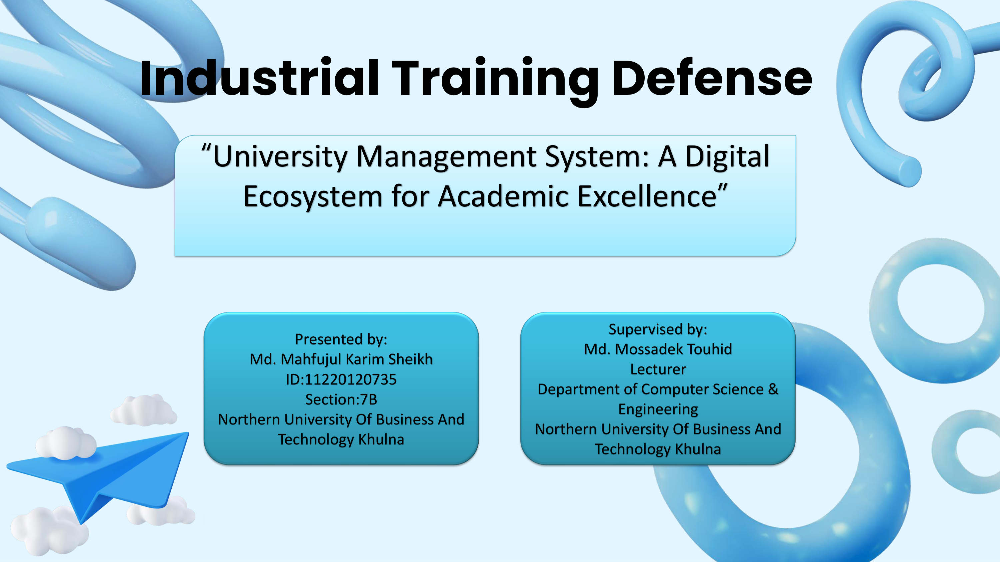
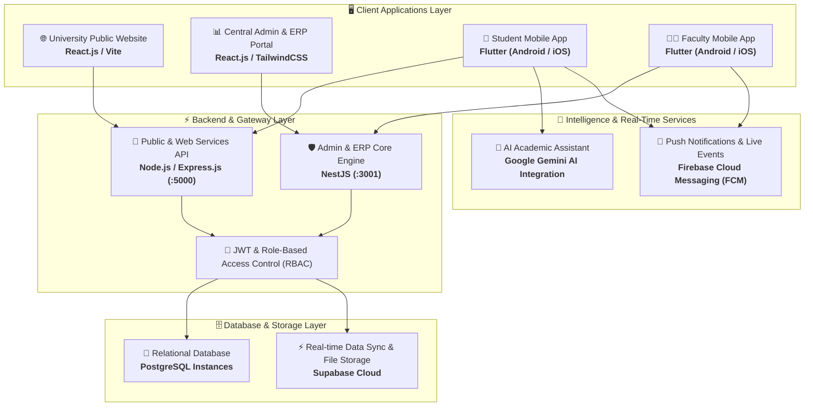
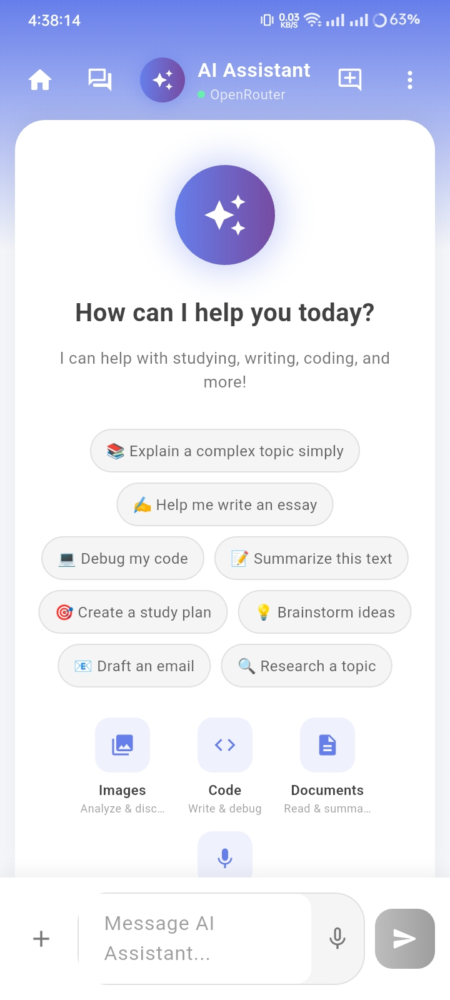
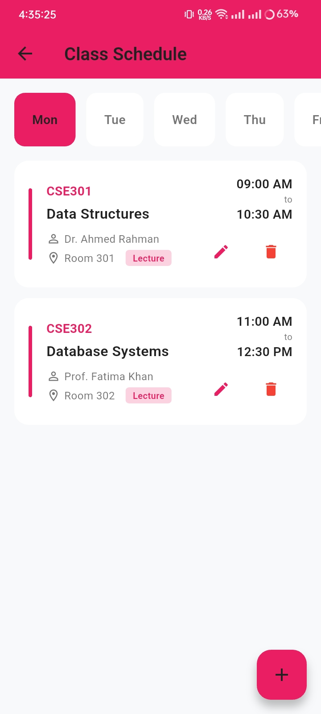
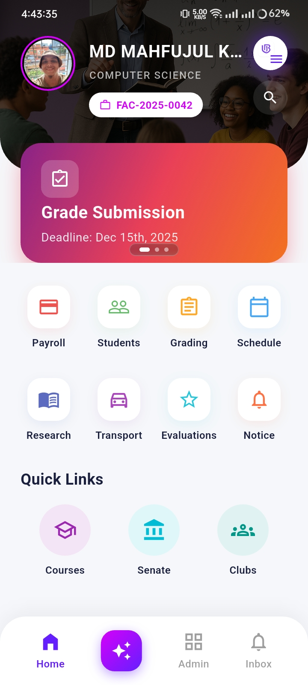
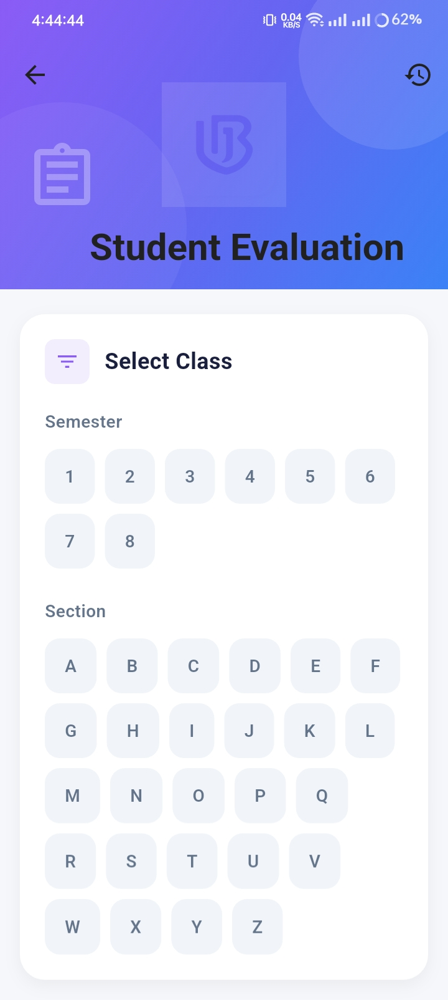
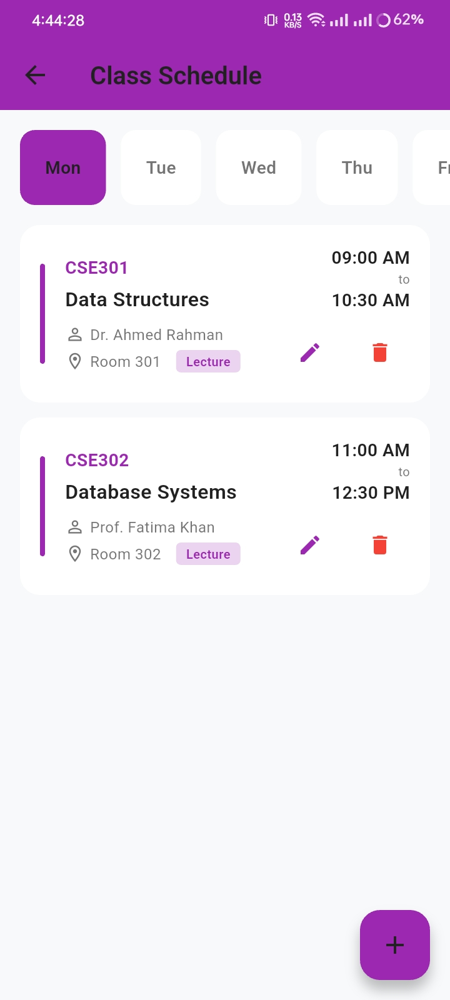

# 🎓 University Management System (NUBTK Automation)
### *A Unified Digital Ecosystem for Academic Excellence & Campus Automation*

  <b>Developed for Industrial Training Defense</b> 
  Department of Computer Science & Engineering (CSE) 
  <b>Northern University of Business and Technology Khulna (NUBTK)</b>

[📑 View Presentation (PDF)](#-industrial-training-defense-presentation) •
[🏛️ System Architecture](#-system-architecture) •
[🌐 Web Portals](#-web-portals) •
[📊 Admin ERP](#-centralized-admin-panel--erp) •
[📱 Mobile Apps](#-mobile-applications-flutter) •
[⚡ Key Features](#-key-features--capabilities)

---

## 📑 Industrial Training Defense Presentation

The complete defense presentation slide deck and project documentation are archived in this repository:

  
    

  
  &nbsp;&nbsp;
  

 

| Academic Details | Information |
| :--- | :--- |
| **Project Title** | University Management System: A Digital Ecosystem for Academic Excellence |
| **Presented By** | **Md. Mahfujul Karim Sheikh** (Student ID: `11220120735`, Section: `7B`) |
| **Supervised By** | **Md. Mossadek Touhid**, Lecturer, Department of CSE |
| **Institution** | **Northern University of Business and Technology Khulna (NUBTK)** |
| **Core Focus** | End-to-end digitisation of academic, administrative, financial, and student workflows |

---

## 💡 Problem Statement & Objective

Traditional university operations rely heavily on manual paperwork, distributed spreadsheets, and disconnected desktop systems. This causes:
- ⏳ **Slow Administrative Turnaround:** Admission, course registration, and document clearance take days or weeks.
- 📉 **Data Redundancy & Errors:** Inconsistent student records across separate departments.
- 🔕 **Communication Gap:** Delays in routine changes, examination schedules, and urgent notifications reaching students.
- 📊 **Lack of Centralized Analytics:** University leadership lacks real-time insight into attendance, fee defaults, and student performance.

### 🎯 The Solution:
**NUBTK Automation** delivers a single, unified digital platform connecting **students, faculty members, and central administration**. It bridges public-facing information portals with deep administrative automation and native mobile apps equipped with an AI-powered academic assistant.

---

## 🏛️ System Architecture

---

## 🌐 Web Portals

### 1. University Public Portal
Modern, responsive web interface for prospective students, current students, faculty, and public visitors.
- Academic regulations, program curriculums, and departmental information.
- Campus virtual tour, event calendars, and official notices.

  

 

### 2. Online Admission & Application Pipeline
- Fully digital admission application submission.
- Real-time document verification and applicant tracking.

  

---

## 📊 Centralized Admin Panel & ERP

The admin dashboard provides full institutional command with predictive business intelligence:
- **Real-Time KPIs:** Live counts of active students (2,800+), faculty members, overall attendance rate, and revenue collection.
- **Workflow Pipeline:** Step-by-step verification (Payment Verified ➔ Documents Verified ➔ Interview Scheduled ➔ Final Approval).
- **AI-Driven Insights:** Automated detection of student dropout risks, fee default predictions, and attendance anomalies.

  

---

## 📱 Mobile Applications (Flutter)

Cross-platform mobile applications tailored specifically for student and faculty daily routines:

### 🎓 Student Mobile App
Equipped with personal profiles, academic tracking, tuition fee payments, dynamic class schedules, and a generative AI study assistant.

<table align="center" width="100%">
  <tr>
    <td align="center" width="33%">
      
        
      <b>🏠 Student Dashboard</b> 
      Online Library, Payment, Course Registration & Results
    </td>
    <td align="center" width="33%">
      
        
      <b>🤖 AI Academic Assistant</b> 
      24/7 AI tutor for syllabus queries, code debugging & concept explanations
    </td>
    <td align="center" width="33%">
      
        
      <b>📅 Dynamic Class Routine</b> 
      Day-by-day lecture timing, room assignments & instructor info
    </td>
  </tr>
</table>

 

### 👨‍🏫 Faculty Mobile App
Empowers professors and course instructors with on-the-go academic management.

<table align="center" width="100%">
  <tr>
    <td align="center" width="33%">
      
        
      <b>📋 Faculty Command Center</b> 
      Grade submission deadlines, course allocation, payroll & notices
    </td>
    <td align="center" width="33%">
      
        
      <b>📝 Student Evaluation & Grading</b> 
      Semester & section-wise marks entry, assessment & grading
    </td>
    <td align="center" width="33%">
      
        
      <b>🕒 Teaching Timetable</b> 
      Direct overview of daily assigned lecture hours and halls
    </td>
  </tr>
</table>

---

## ⚡ Key Features & Capabilities

- 🔐 **Enterprise Security & RBAC:**
  Role-Based Access Control enforcing strict separation of privileges across Superadmin, Department Head, Faculty, and Student tiers. Powered by stateless JWT token rotation.
- 🤖 **AI-Powered Academic Assistant:**
  Integrated with modern LLM intelligence to help students understand complex lecture topics, draft academic queries, review code, and receive tailored course assistance.
- 🚀 **Streamlined Digital Admission:**
  Paperless applicant verification workflow featuring online fee reconciliation and automated admission status alerts.
- 📲 **Real-Time Notification Broadcast:**
  Firebase Cloud Messaging (FCM) delivers instant emergency announcements, class rescheduling notices, and grade releases directly to mobile devices.
- 🛡️ **Data Sanitization & Injection Defense:**
  All REST endpoints incorporate schema validation, SQL injection prevention, and encrypted data storage for sensitive records.

---

## 📈 Measurable Results & Impact

| Metric | Improvement | Description |
| :---: | :---: | :--- |
| 📉 **70%** | **Manual Workload Reduction** | Drastic cut in physical paperwork and manual ledger maintenance. |
| ⚡ **80%** | **Faster Processing** | Admission cycle time reduced from weeks of physical queues to digital minutes. |
| 🎯 **95%** | **Data Accuracy Improvement** | Elimination of duplicate records and manual grade transcript errors. |
| 🌐 **99.5%** | **System Reliability** | High availability with decoupled micro-services and cloud failover. |

---

## 🛠️ Technology Stack Summary

| Domain | Technologies Used |
| :--- | :--- |
| **Mobile Applications** | Flutter, Dart, Riverpod / Provider |
| **Web Frontends** | React.js, Vite, TailwindCSS, Axios |
| **Backend Services** | Node.js, Express.js, NestJS, TypeScript |
| **Databases** | PostgreSQL, Supabase Realtime |
| **Cloud & DevOps** | Firebase (Auth, FCM), Supabase Storage, Docker |
| **AI Integration** | Google Gemini API for Academic Assistant |

---

## 🚀 Future Roadmap

- [ ] **MFS & Payment Gateway:** Integration of bKash, Nagad, and Credit/Debit card automated payment reconciliations.
- [ ] **Parent & Alumni Portals:** Dedicated portals for parent progress tracking and alumni networking.
- [ ] **Automated Exam Hall Seating:** Algorithmic examination seat plan generator to avoid section clustering.
- [ ] **Multi-Region Cloud Deployment:** Geographic redundancy and auto-scaling infrastructure.

---

## 👤 Author & Acknowledgements

- **Developer:** Md. Mahfujul Karim Sheikh
  - Student ID: `11220120735`
  - Section: `7B`, 7th Semester
  - Department of Computer Science & Engineering (CSE)
  - Northern University of Business and Technology Khulna (NUBTK)
- **Academic Supervisor:** Md. Mossadek Touhid
  - Lecturer, Department of CSE, NUBTK

---

  © 2026 Northern University of Business & Technology Khulna. All rights reserved.

